# README

## 1. 팀원 및 업무 분담

- 김수연 - front-end
- 김수진 - back-end & front-end
- 박주동 - front-end & back-end

## 2. ERD 설계

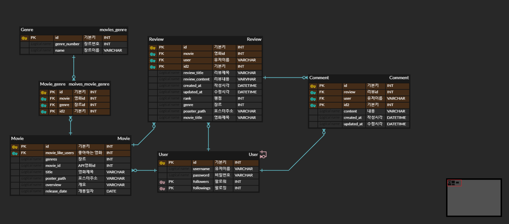

## 3. 서비스 구현

- 영화 정보 제공 기능
- 영화 추천 서비스 
- 커뮤니티 서비스 
- 영화 검색 기능

## 4. 파일구조

- back-end

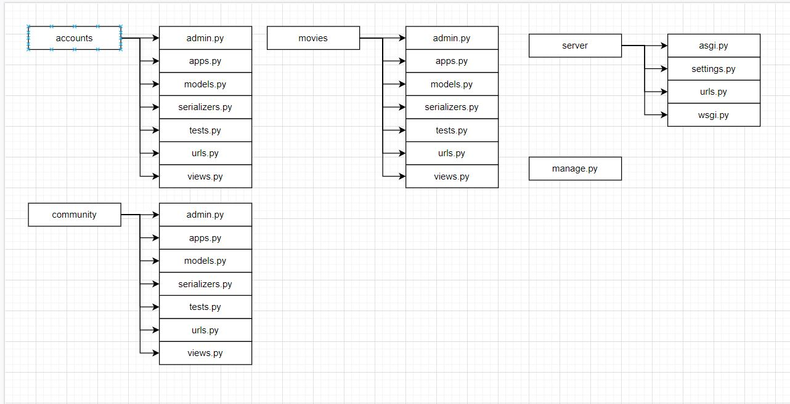

- front-end

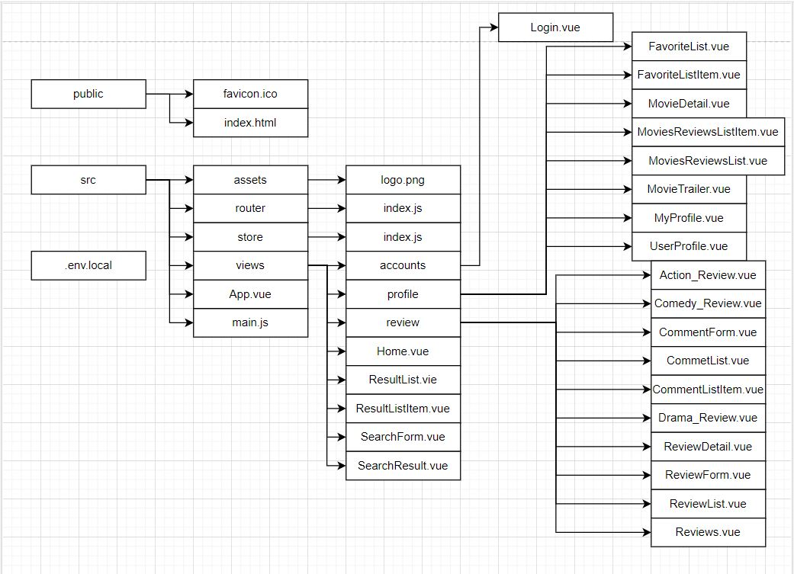

## 5. 기능 설명

### 5.1 계정 생성 및 로그인 기능

#### 5.1.1 Back-end

- url

```python
urlpatterns = [
    path('signup/', views.signup),
    path('api-token-auth/', obtain_jwt_token),
    path('<username>/', views.profile_follow),
]
```

> 인증을 위해 api-token을 발급받는 주소가 맨 아래있으면 토큰이 발급되지 않는 문제가 있었다. 아직 이유를 모르겠으나 토큰발급 주소를 위로 옮겨 해결했었다.
>
> profile주소에서 get요청은 유저정보 요청 post요청은 해당 유저를 팔로우한다.

#### 5.1.2 Front-end

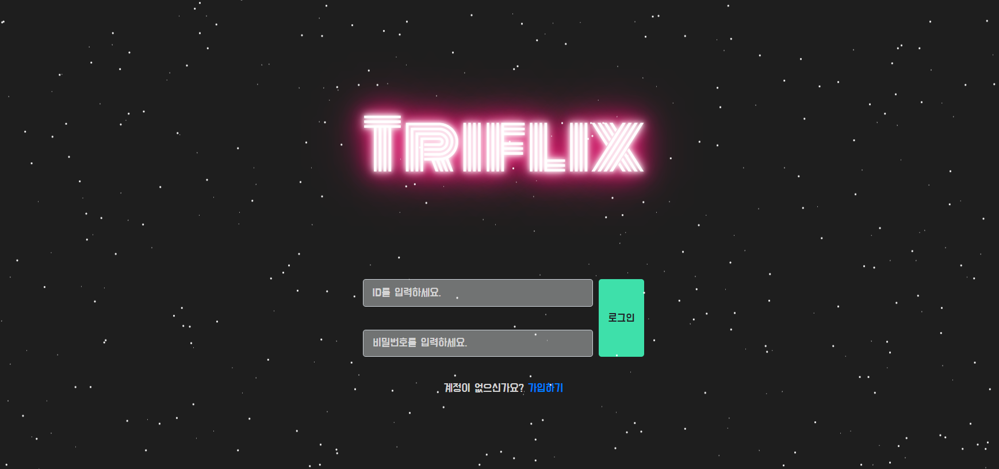

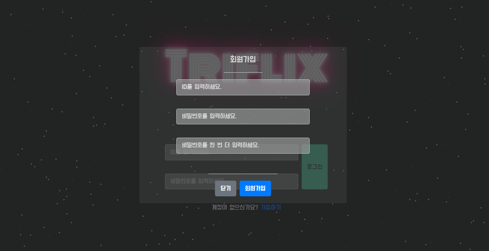

> 회원가입 창은 modal로 제공해준다.
>
> 이 때 처음 모달을 사용했는데 로그인과 회원가입 각각 요청을 보낼 때 사용하는 데이터 오브젝트 이름이 겹쳐서 해결하는 데 시간이 조금 걸렸다.

### 5.2 영화 정보 제공

#### 5.2.1 Back-end

- urls

```python
urlpatterns = [
    path('', views.movie_list),
    path('<int:movie_pk>/', views.movie_detail),
]
```

> 영화 전체정보를 가져오고(첫번째),
>
> 영화 개별 정보 및 해당 영화 찜 기능(두번째)을 한다.

- serializers

```python
from rest_framework import serializers
from .models import Movie

class MovieSerializer(serializers.ModelSerializer):

    class Meta:
        model = Movie
        fields = ('id', 'movie_like_users', 'genres', 'movie_id', 'title', 'poster_path', 'overview', 'release_date', 'movies_reviews')
```

> 해당영화에 대한 리뷰정보들을 보여주기 위해 역참조 이름을 사용해 추가해주었다.

#### 5.2.2 Front-end


> 인기순으로 영화들을 제공한다. carousel을 사용했다.

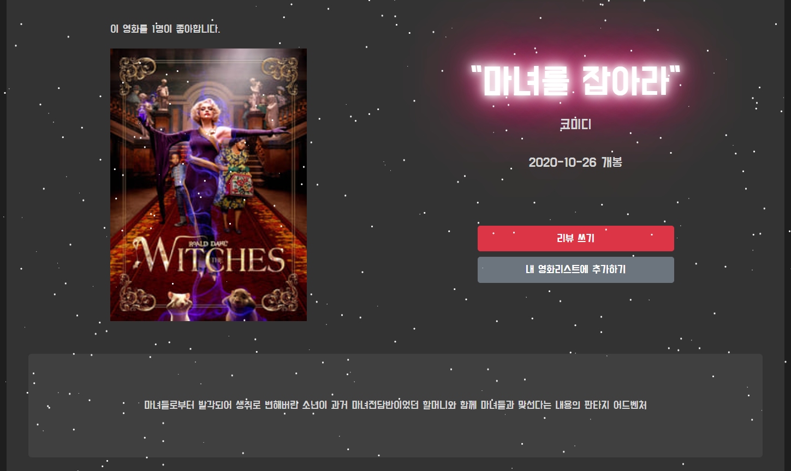

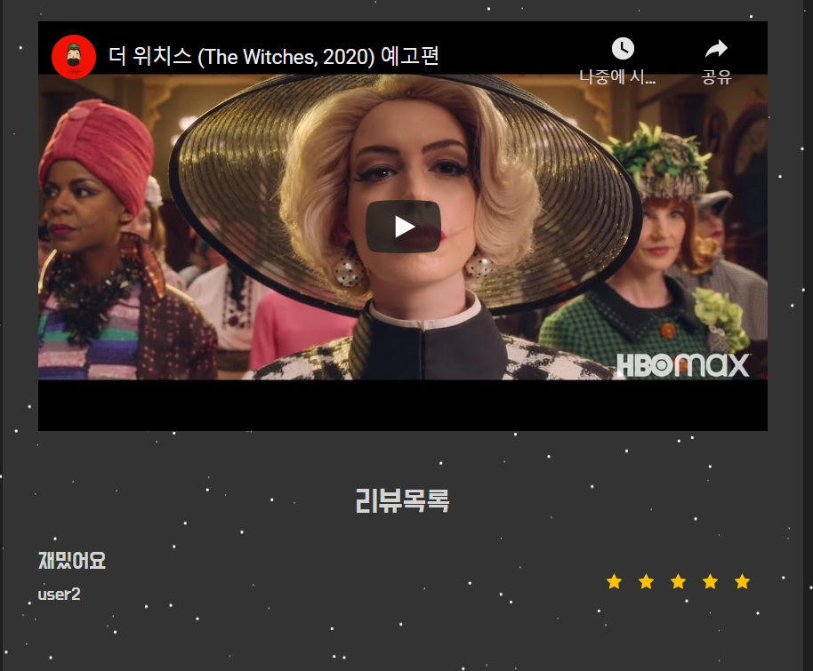

> 영화 상세페이지에서는 영화에 대한 전반적인 정보와 해당영화의 예고편 그리고 리뷰목록을 제공한다. 
>
> 현재 유튜브 검색을 위한 videoId를 쓰는 데에 오류가 발생하지만, 영화 트레일러는 잘 떠서 그냥 냅둔 상태이다.. 유튜브의 쿼리는 '해당영화의 제목 + trailer'이다. 해당영화의 예고편이 유튜브에 존재하지 않으면 전혀 상관없는 영상이 뜨는 문제가 있다.
>
> 영화에 대한 감독 정보와 배우정보를 가저오고 싶었지만 실패했다.. 😥 tmdm의 movieId를 인식하지 못했었다
>
> 영화의 개요가 없는 영화도 존재했는데 if 문을 사용해 개요 정보가 있을 때만 개요를 가져오고 없으면 개요 자리에

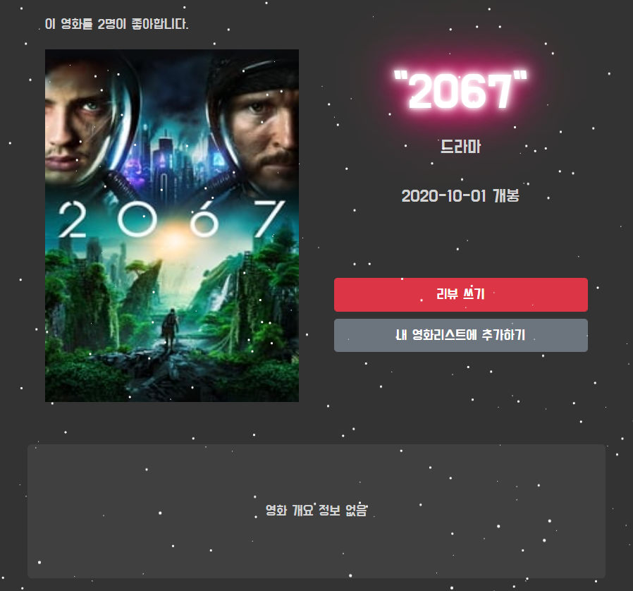

> 개요 정보가 없다는 문구가 나오게 했다.
>
> 장르는 영화마다 여러 개의 장르 정보를 갖고있었는데 첫번 째로 오는 장르가 제일 주된 장르라고 생각하고 첫번 째 장르정보를 사용했다. 장르 정보는 숫자로 되어있었는데 그 숫자에 대한 장르정보를 vuex를 사용해 state에 저장해 숫자를 장르정보로 바꿔주었다.
>
> 최하단에 있는 리뷰정보에서 리뷰의 제목을 누르면 리뷰 상세페이지로 이동하고, 작성자를 누르면 작성자의 프로필로 이동한다.

### 5.3 커뮤니티 서비스

#### 5.3.1 Back-end

- url

>  리뷰 생성 및 조회, 리뷰 좋아요, 댓글 생성 및 삭제를 위한 주소
>
> 리뷰를 좋아요 순으로 나열할 생각이었지만,리뷰 좋아요 기능은 나중에 삭제하였다.

- models

>  원하는 형식의 데이터를 받기위해 많이 수정했다. 
>
> user정보가 숫자 형식(user_pk)으로 와서 작성자 정보를 띄워주기 불편해서 외래키가 아닌 캐릭터필드로 사용했다.

- serilaizer

> comments 필드를 CommentSerializer를 사용해 넣어주었다. 맨 처음에 이 방식이 생각이 안나 여러 방법을 다 뒤져봤었다. (Viewset 등등 ..)

- views.py

> user정보를 점겨줄 때도 user가 아닌 username으로 넘겨줘야 한다

#### 5.3.2 Front-end

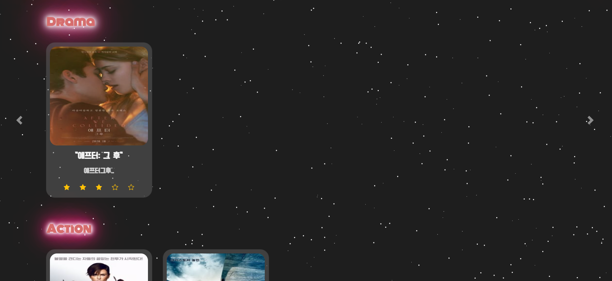

> 장르 별 리뷰를 보여준다. 필터를 사용했다. 카드를 클릭하면 리뷰 상세페이지로 이동한다.

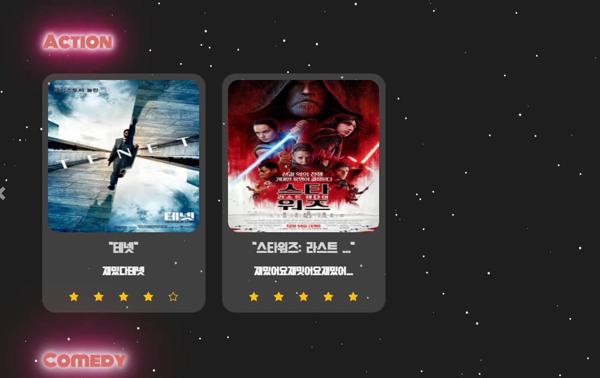

> 글자 수가 일정 수를 넘어가면 trunc된다. 커스텀필터를 사용했다.

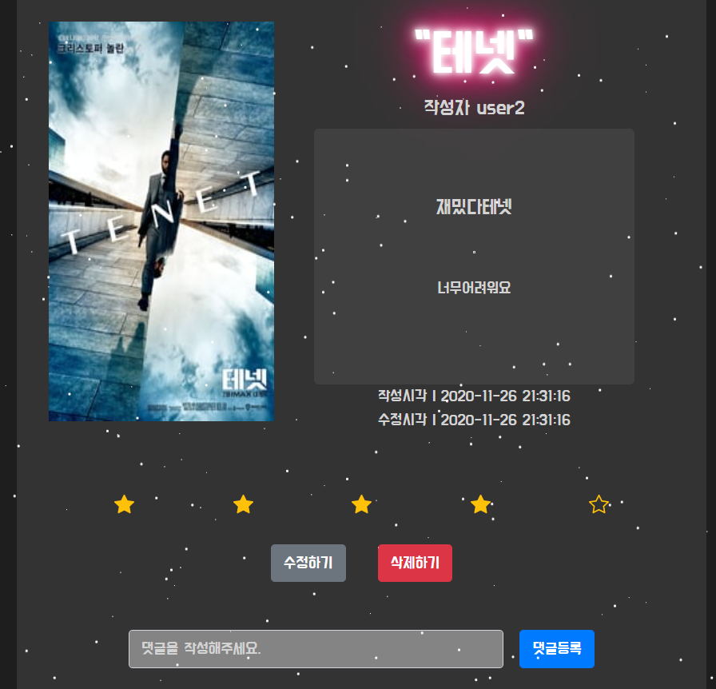

> 수정하기와 삭제버튼은 작성자에게만 보인다.
>
> 영화제목을 클릭하면 영화 상세페이지로 이동하고 작성자를 클릭하면 작성자의 프로필로 이동한다. 별점은 readonly기능을 사용해 읽기만 할 수 있다.

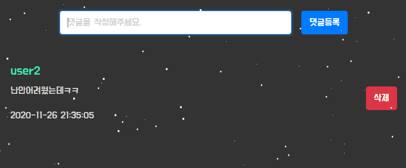

> 댓글 작성후 비동기 처리를 위해 emit을 사용해 댓글 객체를 넘겨준다.
>
> 하지만 보이는 거만 처리된거이므로 바로 삭제하려면 새로고침이 필요하다. 

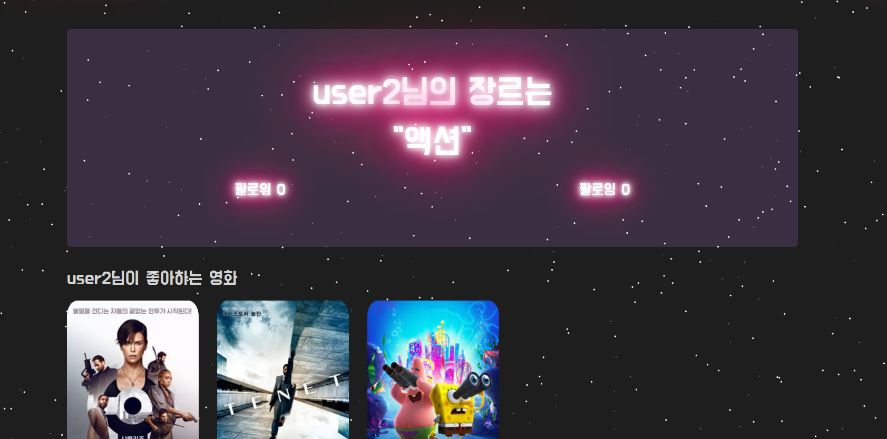

> 프로필에서는 자신의 팔로워와 팔로잉 수를 보여주고 자신이 이때까지 재밌게본 영화들을 보여준다. 그리고 사용자가 가장 좋아하는 장르를 같이 보여준다.
>
> 자신의 프로필인 경우 팔로우를 할 수 없다. 
>
> 팔로우 후 비동기 처리가 어려웠는데 해당 데이터를 가져온 데이터로 업데이트 해주는 형식으로 처리했다.
>
> 좋아하는 영화들의 이미지를 누르면 영화 상세페이지로 이동할 수 있다.

### 5.4 영화 추천 기능

> 커뮤니티 기능을 사용한 영화 추천 기능.
>
> 사용자는 자신과 영화 취향이 겹치는 다른 사용자를 팔로우 할 수 있다.
>
> 아직 다른 사용자를 팔로우하지 않아 정보가 부족 한 경우에는

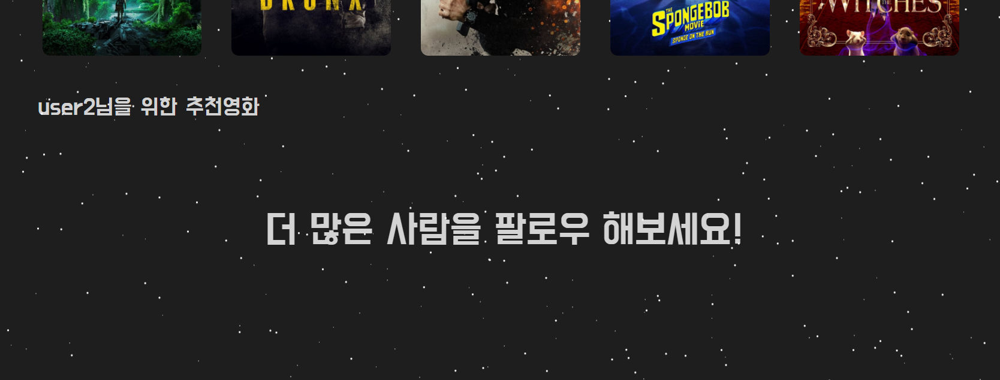

> 해당 문구가 뜬다. 하지만 자신과 취향이 같은 다른 사람을 팔로우했을 때는,

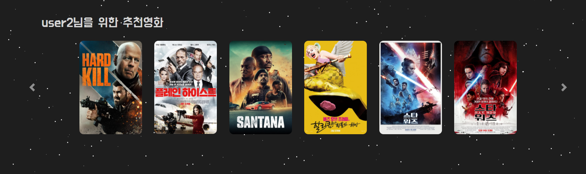

> 그 다른 사람의 영화 리스트에서 자신의 리스트에 없는 영화들을 추천해준다.

### 5.5 영화 검색 기능

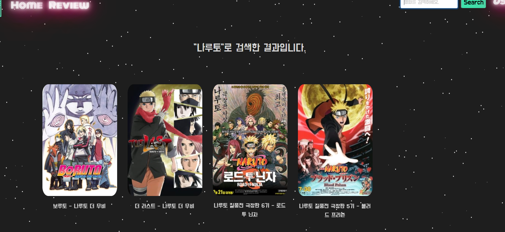

> .includes를 사용해 영화 제목에 키워드가 들어가는 모든 데이터들을 나열해준다. 해당 이미지와 제목을 클릭하면 해당영화의 상세페이지로 이동한다.
>
> 현재 이 기능의 비동기처리가 되어있지 않은 상태이다. 현 상태에서 다른 키워드를 검색하면

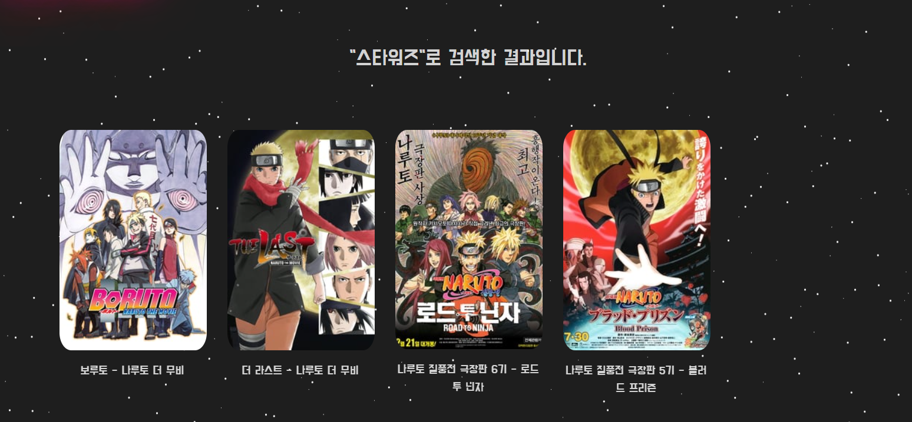

> 검색은 되지만 데이터는 바뀌지 않는다. 여러 방법을 사용해 봤지만 아직 해결하지 못했다..

## 6. 느낀 점

> 백엔드 설계를 맡은 다음 할 일이 많은 프론트로 넘어왔는데 백엔드 설계가 훨씬 수월했다.. vue를 배운지 얼마 안되어서 그런진 모르겠지만..🤣
>
> 처음에는 마땅한 협업 툴을 찾기도 힘들었고 다른 조에 비해 뒤쳐지는 느낌이 강해서 너무 힘들었다. 하지만 걱정은 뒤로 미루고 무작정 시작해보니 어떻게든 프로그램이 만들어졌다. 
>
> 생각 외로 프론트엔드가 너무 힘들었다. 새로 배운 것 중에 가장 유용하게 쓴 기능은 router에서 params 를 같이 넘겨 push하는 기능이다. 관계 설정이 어려운 다른 컴포넌트로 사용자를 보내줄 때 정말 유용하게 쓰였다.
>
> 또 데이터를 비동기 처리하는 과정이 상황마다 달라야해서 방법을 생각해내는게 어려웠다. 그래서 아직 비동기 처리가 되지 않는 기능도 있어서 아쉽다.
>
> 또 css스타일링을 위해 애니메이션 배경을 갖다 썼는데 어째서인지 배경 요소가 데이터 요소보다 앞으로 나오는 문제가 발생했었다. 심하게 거슬리지 않아 그냥 내비둔 상태이긴 한데 아직 해결방법을 모르겠다.
>
> 코로나로 인해서 온라인으로 프로젝트를 완성했는데 불편하긴 했지만 내 예상보다는 수월했다. 가끔 협업 툴이 말썽일 때만 불편했고 다른 사람의 화면을 바로바로 볼 수 있어서 디버깅 과정도 꽤나 신속하게 이루어졌다.
>
> 코딩을 하면서 이 방식이 맞는가 하는 의문을 계속 품었다. 뭔가 너무 비효율적인 거 같고 남들은 더 효율적인 방법으로 처리할 것 같다는 생각에 의욕이 떨어졌었지만 프로그램은 완성해야 하므로 계속 진행했다
>
> 처음에는 프로젝트를 쉬엄쉬엄 진행하려했지만 진행하다보니 욕심이 많아져 시간이 없어져서 저절로 늦은 밤까지 코딩을 하게 되었다.
>
> 스타일링을 위해 class를 여러개 만들어주었는데 아마 그 중에 중복되는 것도 여러개 있을 것이다. 컴포넌트가 많아지니 이런 관리가 너무 힘들었다. 사실 남들에 비해 컴포넌트가 비정상으로 많은 것 같다..🙄 그냥 필요한 데로 무작정 만들다 보니 필요이상으로 많아져 관리가 힘들었다. 나중에 구조 정리를 할 때 시간이 걸렸다.
>
> 프로젝트 중간에는 생각했던 기능들을 다 구현 못할 줄 알아서 너무 걱정했는데 막상 시간이 촉박해지니 저절로 속도가 빨라진 기분이다.
>
> 프로젝트를 마무리하고 최종 프로그램을 둘러보니 너무 뿌듯했다. 
>

